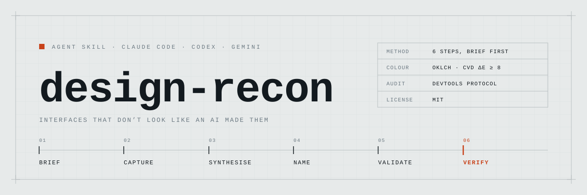

<picture>
  <source media="(prefers-color-scheme: dark)" srcset="assets/banner-dark.svg">
  
</picture>

Ask any coding agent for a landing page and you get the same one: dark ground, a
single neon accent, cards rounded to an identical radius, a gradient glow behind
the hero, emoji standing in for icons. Ask it to *make it less generic* and you
get a different flavour of that same page — because the model is still designing
from memory, and memory **is** the default.

`design-recon` replaces designing-from-memory with a procedure. Brief the user in
forced choices. Open a headless Chrome and capture what real sites in the
category actually do. Take exactly one structural move from each. Then verify the
result by measuring it, not by looking at it.

> **The screenshot is not the evidence.** Four of the most convincing "bugs" in a
> rendered page are artefacts of how the screenshot was taken. They are named
> below, because each one costs an afternoon if you chase it.

---

## Three ways a design reads as AI-made

They need different fixes, and treating one as another gets you rejected twice.

| | Looks like | The fix |
|---|---|---|
| **1 · The generic AI aesthetic** | Dark ground, one neon accent, uniform card radius, gradient glow, emoji icons, a perfectly symmetrical grid | Commit to a specific named direction and execute it precisely |
| **2 · An inherited house style** | Warm cream, terracotta accent, serif display — that is *Anthropic's* identity. Or the worked examples from the guide you just read | Ask outright: does this look like the company that made me, or like the last thing I made? |
| **3 · Correct but flat** | Validated palette, clean type, correct spacing, and still lifeless — every element a flat rectangle in a tidy grid | Go back to the captures and find what they do that the draft does not |

**Number two is the one that will get you.** No generic-AI checklist catches it,
because it is not generic — it is a real, coherent visual identity. Just not the
one you were hired to build. A human spots it in about a second.

---

## Install

<details open>
<summary><b>Claude Code</b></summary>

```bash
claude plugin marketplace add xerenon/design-recon
claude plugin install design-recon@design-recon
```

Or from inside a session:

```
/plugin marketplace add xerenon/design-recon
/plugin install design-recon@design-recon
```

</details>

<details>
<summary><b>Codex · Gemini CLI · Copilot CLI · anything else</b></summary>

Copy the skill folder into the agent's skills directory. Both `~/.claude/skills/`
and the cross-runtime `~/.agents/skills/` are recognised.

```bash
git clone https://github.com/xerenon/design-recon.git /tmp/design-recon
cp -r /tmp/design-recon/skills/design-recon ~/.agents/skills/
```

</details>

The skill loads itself when a design task comes up; you can also invoke it by
name. The bundled tool wants [Bun](https://bun.sh) and any Chromium build — it
finds Chrome, Chromium or Edge on its own, and `CHROME_PATH` overrides. Neither
is required to follow the method.

---

## The procedure

Six steps, in order. Colour is step five. Most bad pages decide it first.

### 1 · Brief before looking at anything

Forced choices, never open questions. *"What feeling do you want?"* returns
**modern and clean** from everyone. Poles force a real answer, and the whole
brief goes out in a single pass — five separate questions gets abandoned halfway.

| Ask | Poles | What it settles |
|---|---|---|
| Who arrives, and from where? | cold social traffic ↔ searched for you | how much the page must explain before it can sell |
| Register | talks like a friend ↔ talks like an expert | type weight, colour saturation, copy voice |
| How much strange can this afford? | must feel familiar ↔ must be remembered | whether to break the grid at all |
| What must it **not** look like? | *asked open* | the fastest constraint you will ever get |

*"Not like a hospital"* tells you more in four words than a page of brand values,
and it goes straight into the capture list.

### 2 · Capture real sites — this step is the skill

Eight to twelve, spread across four buckets: direct competitors, the adjacent
category, **outside the category entirely**, and the target market's own
culture. The third bucket is what makes the result new — a page assembled only
from competitors converges on the category average by construction, because
every input already agrees with every other one.

Nine questions go with each capture, ending in the one that matters: *what would
you still remember about this page tomorrow?* A site with no answer to it is not
a reference, it is a competitor.

You cannot skip this step. If no real site can be seen, the skill says to stop
and say so — a design built from remembered examples comes out looking like
whatever you built last.

### 3 · Synthesise — take, transform, then check

One structural move per reference, each traced to a line in the brief; anything
that cannot be traced gets cut. But stacking one move per site only gives you
the *average* of the references, so at least one has to be transformed:
**transfer** it onto a different element than the reference uses it on,
**combine** it with a move no reference combines it with, or **push** it further
than any reference dares. Exactly one push — two read as noise.

Then the question the whole step exists for: *what does the finished page have
that none of the captured sites has?*

### 4 · Name the operation behind every decision

"Warm and editorial" is a mood. *Clip an idiom*, *shift the register*, *stack two
meanings* are decisions. If you cannot name the operation, you picked it from
memory.

### 5 · Validate colour computationally

Never by eye. A rose/green pair that looked perfectly fine in the mock failed
colour-blind separation at **ΔE 4.5** — the classic red/green trap, and
completely invisible until measured.

### 6 · Verify by rendering *and* measuring

Screenshots alone manufacture false alarms. Measurements alone miss visual
collisions. You need both, and the skill says which question each one answers.

---

## The tool

`skills/design-recon/capture.ts` — three modes, headless throughout. Nothing
opens on screen and your own browser profile is never touched.

```bash
# 1 · see what the category actually looks like
bun capture.ts refs ./refs 1280 \
  "noom|https://www.noom.com/" "arc|https://arc.net/" "monzo|https://monzo.com/"

# 2 · audit your own page — layout report, then full-page slices
bun capture.ts page http://localhost:3000/ ./out/page.png 430

# 3 · viewport-only at a scroll offset — the only honest way to see sticky elements
bun capture.ts shot http://localhost:3000/ ./out/nav.png 1280 900
```

`page` prints a report before it writes a single pixel:

```json
{
  "viewport": 430,
  "scrollWidth": 430,
  "horizontalOverflow": false,
  "fontsLoaded": ["Anuphan", "Archivo"],
  "monoOnNonLatinText": []
}
```

That last field catches a bug you cannot see. A monospace face carries no Thai,
Devanagari or CJK glyphs, so applying one to that text silently falls back to
something else: the type system quietly breaks and the screenshot looks fine.

---

## Field notes

### Four screenshot artefacts that look like bugs

| Looks like | Actually |
|---|---|
| A font failed to load | Shot taken before `document.fonts.ready` |
| Content overflowing the viewport | Wrong viewport width, or a decoration clipped on purpose by an `overflow: hidden` parent |
| The navbar floating in the middle of the page | `captureBeyondViewport` combined with `position: sticky` |
| Whole sections rendered blank | Scroll reveals never fired — walk the page before you shoot |

### The only horizontal-overflow test that means anything

```js
document.documentElement.scrollWidth === window.innerWidth
```

A bounding-box scan across every element will report each blurred wash, marquee
track and deliberately clipped decoration as a bug. None of them are.

### A dead domain screenshots clean

Chrome renders its own error page and the capture succeeds, so the tool checks
`errorText` and asserts the body carries real content before it will call a shot
good.

---

## What it will not do

- The method is written up from one real project, not a controlled study. Treat
  it as a field procedure, not a paper.
- Some sites refuse headless browsers. The tool reports the refusal rather than
  quietly handing you a screenshot of an error page — but it cannot get in.
- It does not judge whether a page converts. Only traffic answers that.

## Provenance

One Thai-language landing page, five rejected directions before one shipped. In
order: generic AI aesthetic → the model's own house style → correct but flat →
flourishes but a weak navbar → shipped. Every rejection was a *different* failure
mode, which is why diagnosing the one you have is most of the work.

The non-Latin typography rules were worked out in Thai and generalise to any
script that stacks marks above and below the line: monospace has no glyphs for
it, letter-spacing pulls tone marks off their bases, and a 1.2 line-height
collides.

## Colophon

The plate at the top of this file is set entirely in the reader's own monospace
face at three sizes — a repo about measuring things should look like one. It
ships in two versions, and the dark plate is re-stepped from the same ramp rather
than inverted, because flipping a palette is the exact shortcut this skill exists
to stop.

## License

MIT
